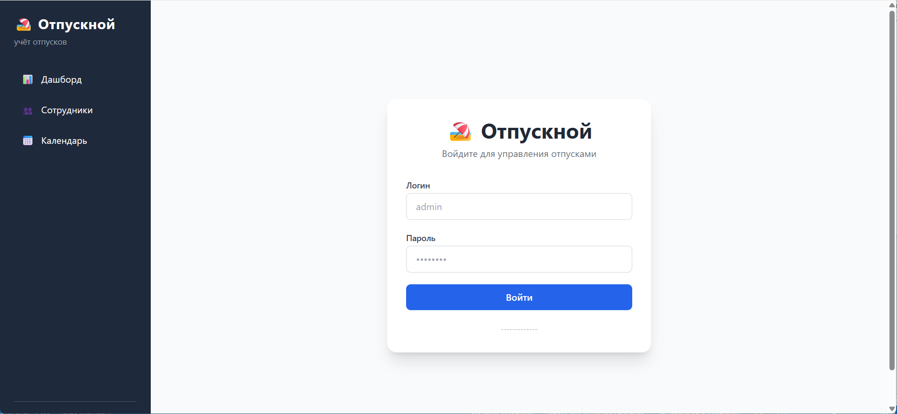
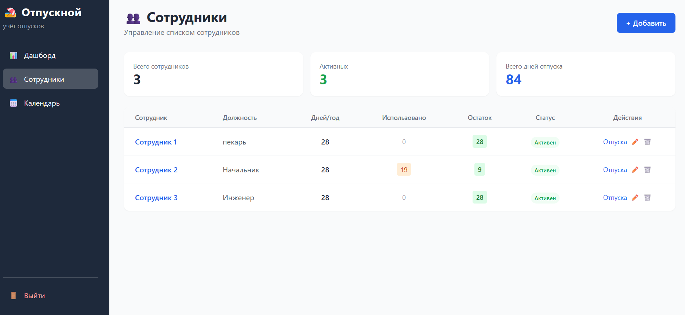
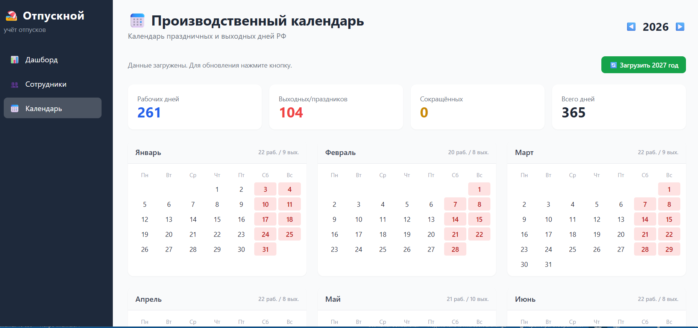

# Отпускной

Сервис учёта отпусков сотрудников. FastAPI + SQLite +  JWT-авторизация.

## Возможности

- 👥 Управление сотрудниками (добавление, редактирование, удаление)
- 🏖️ Учёт отпусков (запланирован / активен / завершён / отменён)
- 📊 Диаграмма Ганта на дашборде (визуализация отпусков по месяцам)
- 📅 Производственный календарь РФ (локальная генерация, госпраздники, переносы выходных)
- 🔐 JWT-авторизация (httponly cookie)
- 🛡️ Rate limiting: 5 попыток входа в минуту (защита от перебора)
- 🐳 Docker + docker-compose

## Скриншоты

| Дашборд | Управление сотрудниками | Производственный календарь |
|---|---|---|
|  |  |  |

## Быстрый старт (локально)

```bash
pip install -r requirements.txt
uvicorn app.main:app --host 0.0.0.0 --port 8000
```

По умолчанию логин/пароль: `admin` / `admin`.

## Смена пароля

Задать переменную `ADMIN_PASSWORD` в окружении или Coolify:

```
ADMIN_PASSWORD=мой_новый_пароль
```

При старте приложение хеширует пароль, сохраняет в БД, и удаляет `ADMIN_PASSWORD` из переменных окружения (не остаётся в памяти). Дальнейшие запуски без `ADMIN_PASSWORD` не меняют пароль — используется сохранённый хеш.

## Переменные окружения

Все настройки через переменные окружения. В Coolify выставляются в разделе Environment Variables.

| Переменная | По умолчанию | Описание |
|---|---|---|
| `SECRET_KEY` | `super-secret-key-change-in-production` | Ключ для JWT |
| `DATABASE_URL` | `sqlite:///./data/otpysk.db` | Путь к SQLite БД |
| `ADMIN_LOGIN` | `admin` | Логин администратора |
| `ADMIN_PASSWORD` | `""` | Пароль админа обычным текстом (хешируется при старте) |
| `ALGORITHM` | `HS256` | Алгоритм JWT |
| `ACCESS_TOKEN_EXPIRE_MINUTES` | `480` | Время жизни токена (минут) |

## Деплой (Coolify)

### 1. Сборка

Ресурс типа **Docker Compose**, ветка `dev`.

### 2. Persistent Storage

Уже настроено в `docker-compose.yaml` — volume `otpysk-data` монтируется в `/app/data`. БД сохраняется между деплоями.

### 3. Environment Variables

Переопределить нужные переменные в Coolify. Обязательно задать `DATABASE_URL`:

```
DATABASE_URL=sqlite:///./data/otpysk.db
```

## Структура проекта

```
├── Dockerfile
├── docker-compose.yaml
├── .gitignore
├── requirements.txt
├── README.md
└── app/
    ├── main.py            # Точка входа, lifespan, инициализация БД
    ├── config.py          # Настройки (pydantic-settings)
    ├── database.py        # SQLAlchemy engine + сессии
    ├── models/            # Модели БД
    │   ├── admin.py
    │   ├── employee.py
    │   ├── vacation.py
    │   └── calendar.py
    ├── routers/           # HTTP-роутеры
    │   ├── auth.py        # /api/auth/login, logout
    │   ├── employees.py   # /employees/*
    │   ├── vacations.py   # /vacations/*
    │   ├── calendar.py    # /calendar/api/* (включая переносы)
    │   └── pages.py       # HTML-страницы (Jinja2)
    ├── services/
    │   └── calendar_service.py  # Генерация календаря (праздники + переносы)
    ├── utils/
    │   └── auth.py        # JWT, хэширование паролей
    ├── calendar_holidays.json # Справочник праздников (в образе)
    ├── templates/         # Jinja2-шаблоны
    └── static/            # Статика (CSS, JS)
├── data/
│   └── calendar_holidays.json  # Переносы (на volume, сохраняются между деплоями)
```

## Производственный календарь

Календарь генерируется локально на основе фиксированного списка государственных праздников РФ (Новый год, 23 февраля, 8 марта, 1 и 9 мая, 12 июня, 4 ноября). Если праздник выпадает на субботу или воскресенье — выходной автоматически переносится на ближайший рабочий день.

Дополнительные переносы (утверждённые постановлениями Правительства) добавляются через админку на странице `/calendar` в блоке «📌 Переносы выходных дней». Данные сохраняются в `data/calendar_holidays.json` на persistent volume и не теряются при деплоях.

## API

| Метод | Путь | Описание |
|---|---|---|
| `GET` | `/` | Дашборд с диаграммой Ганта |
| `GET` | `/login` | Страница входа |
| `POST` | `/api/auth/login` | Вход (form: login, password) |
| `GET` | `/api/auth/logout` | Выход |
| `GET` | `/employees` | Список сотрудников |
| `GET` | `/employees/{id}` | Детали сотрудника |
| `POST` | `/employees/api` | Создать сотрудника |
| `POST` | `/employees/api/{id}/edit` | Редактировать сотрудника |
| `GET` | `/employees/api/{id}/delete` | Удалить сотрудника |
| `POST` | `/vacations/api/add` | Добавить отпуск |
| `POST` | `/vacations/api/{id}/edit` | Редактировать отпуск |
| `GET` | `/vacations/api/{id}/delete` | Удалить отпуск |
| `GET` | `/calendar` | Производственный календарь |
| `POST` | `/calendar/api/update` | Обновить календарь за год |
| `POST` | `/calendar/api/transfer/add` | Добавить перенос выходного дня |
| `GET` | `/calendar/api/transfer/delete` | Удалить перенос выходного дня |
| `GET` | `/health` | Health check |
